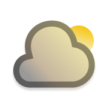
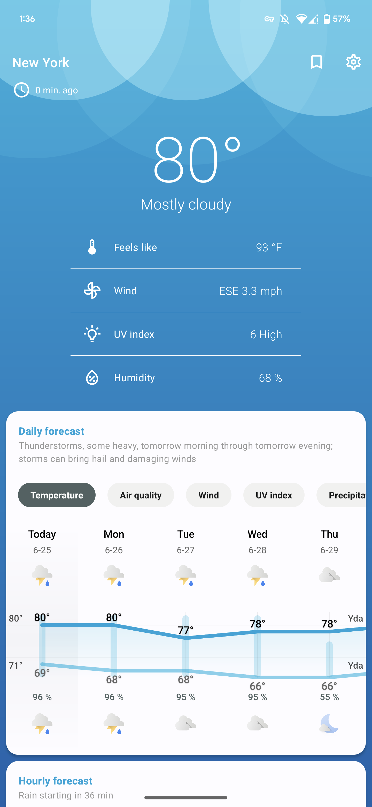

 

<h1 align="center">ClimaSense</h1>

 

  
  
  
  
   
  
  
  

<h4 align="center">climasense is a weather app with a focus on design, with a simple, clean, beautiful UX, smooth animations, and Material You Design all over, plus lots of customizability.</h4>

    

# Download

*More will be added soon.*

# Features

- Weather data
    - Daily and hourly forecasts up to 16 days
      - Temperature
      - Air quality
      - Wind
      - UV index
      - Precipitation
    - Precipitations in the next hour
    - Air quality
    - Allergen
    - Ephemeris (Sun & Moon)
    - Severe weather and precipitation alerts
    - Real-time weather conditions
      - Temperature
      - Feels like
      - Wind
      - UV index
      - Humidity
      - Dew point
      - Atmospheric pressure
      - Visibility
      - Cloud cover
      - Ceiling

- 

Multiple weather sources (<a href="docs/SOURCES.md">comparison</a>)

  - Open-Meteo
  - AccuWeather (don't working for now)
  - MET Norway
  - OpenWeatherMap
  - Météo France
  - Mixed China sources (don't working for now)

- Large selection of home screen widgets for at-a-glance information
- Live wallpaper
- Custom icon packs
  - [Geometric Weather icon packs](https://github.com/breezy-weather/breezy-weather-icon-packs/blob/main/README.md)
  - Chronus Weather icon packs
- Automatic dark mode

# Help

* [Frequently Asked Questions / Help](HELP.md)
* [Homepage explanations](docs/HOMEPAGE.md)
* [Weather sources comparison](docs/SOURCES.md)

# Contribute

Pull requests are welcome. For major changes, please open an issue first to discuss what you would like to change.

* [Create a new weather source guide](CONTRIBUTE.md)

# Translations

Translation is done externally [on Weblate](https://hosted.weblate.org/projects/breezy-weather/breezy-weather-android/#information). Please read carefully project instructions if you want to help.

* English regional variants must be updated on GitHub if they differ from the original English file
* French translation is maintained by repo maintainers

# Contact us

* Matrix server: `#breezy-weather:matrix.org`
* GitHub discussions or issues

# Build variant

A variant called `gplay` is available and will be distributed on Google Play Store once ready.
It enables Instant App and bundles Google Network Location Provider (proprietary).

# License

* [GNU Lesser General Public License v3.0](/LICENSE)
* [Forked from Geometric Weather](https://github.com/WangDaYeeeeee/GeometricWeather)
